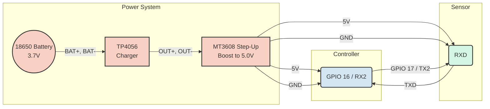

### Schematics

```mermaid
graph LR
    subgraph Power System
        B((18650 Battery\n3.7V)) -->|BAT+, BAT-| TP[TP4056\nCharger]
        TP -->|OUT+, OUT-| MT[MT3608 Step-Up\nBoost to 5.0V]
    end

    subgraph Controller
        ESP[ESP32 Dev Module]
    end

    subgraph Sensor
        SDS[SDS011 Dust Sensor]
    end

    %% Power Connections
    MT -->|5V| ESP(VIN / 5V)
    MT -->|GND| ESP(GND)
    MT -->|5V| SDS(5V pin)
    MT -->|GND| SDS(GND pin)

    %% Data Connections (UART)
    SDS -->|TXD| ESP(GPIO 16 / RX2)
    ESP -->|GPIO 17 / TX2| SDS(RXD)
    
    classDef power fill:#f9d0c4,stroke:#333,stroke-width:2px;
    classDef logic fill:#d4e6f1,stroke:#333,stroke-width:2px;
    classDef sensor fill:#d5f5e3,stroke:#333,stroke-width:2px;
    
    class B,TP,MT power;
    class ESP logic;
    class SDS sensor;
```